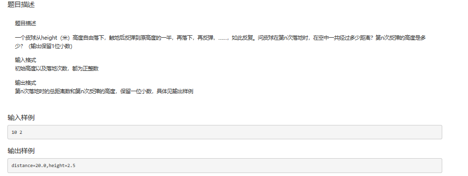
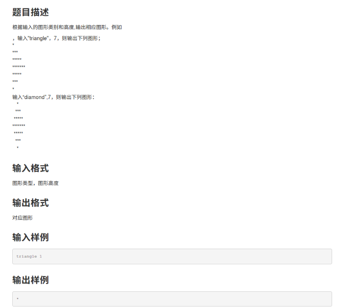
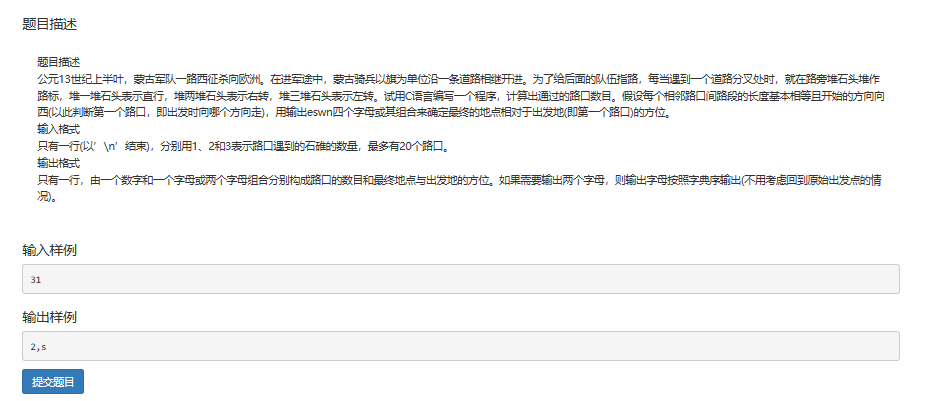
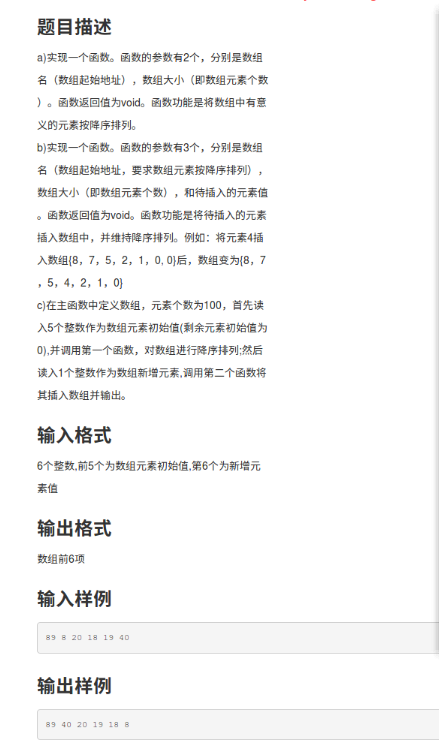
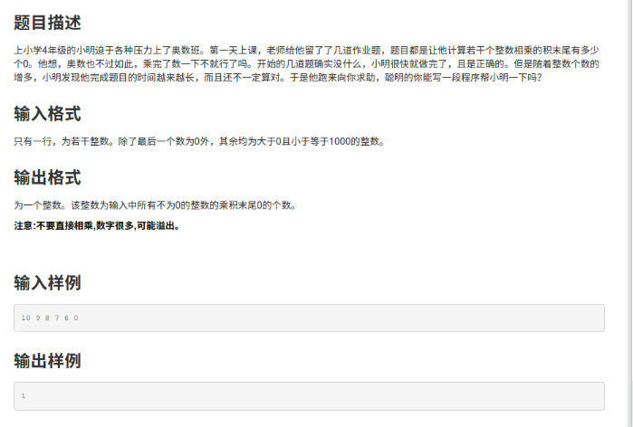

危险的民主
==========

![C:\\Users\\冯立\\Documents\\Tencent Files\\2276542177\\FileRecv\\MobileFile\\Image\\J87Z_1JRLF]K0GMA\`8[K3\@6.png](media/89ea2026807f05b9603266c962bb8ddd.png)

\#include\<stdio.h\>

main()

{

int i,j,ge,zu[101],tem,ban,sum=0;

scanf("%d",\&ge);

for(i=0;i\<ge;i++)

scanf("%d",\&zu[i]);

for(i=0;i\<ge-1;i++)

{for(j=0;j\<ge-1-i;j++)

{if(zu[j]\>zu[j+1])

{ tem=zu[j];

zu[j]=zu[j+1]; //使最大的数沉底

zu[j+1]=tem; } } } //冒泡排序法（从小到大）

for(i=0;i\<ge;i++)

zu[i]=(zu[i]+1)/2; //每组当中至少一半的票数

ban=(ge+1)/2;

for(i=0;i\<ban;i++)

sum=sum+zu[i]; //全部当中所需要的票数

printf("%d",sum);

system("pause");

}

2.小球触地
==========

>   C:\\Users\\冯立\\Documents\\Tencent
>   Files\\2276542177\\FileRecv\\MobileFile\\Image\\Z\`XHK[}7J7YC)RS{AU\$Z(V5.png

>   \#include\<stdio.h\>

>   main()

>   { float h,n,s,i;

>   scanf("%f%f",\&h,&n);

>   s=h;

>   for(i=1;i\<n;i++)

>   {h=h/2;

>   s=s+2\*h;

>   }

>   printf("distance=%.1f,height=%.1f",s,h/2);

>   system("pause");

>   }

3打印三角与菱形
===============

>   C:\\Users\\冯立\\Documents\\Tencent
>   Files\\2276542177\\FileRecv\\MobileFile\\Image\\0YK)ZCFPPFQ{3WN[}BO9T25.png

>   \#include\<stdio.h\>

>   \#include\<string.h\>

>   main()

>   { int i,j;

>   int n;

>   char s[10];

>   scanf("%s",s);

>   scanf("%d",\&n);

>   if(strcmp(s,"triangle")==0)

>   {for(i=1;i\<=(n+1)/2;i++)

>   {for(j=1;j\<=2\*i-1;j++)

>   {printf("\*");}

>   printf("\\n");

>   } //完成上半部分的图案（对行和列分别控制好）

>   for(i=1;i\<=n/2;i++)

>   {for(j=1;j\<=n-2\*i;j++)

>   {printf("\*");}

>   printf("\\n");

>   }

>   } //完成下半部分的图案

>   if(strcmp(s,"diamond")==0)

>   {for(i=1;i\<=(n+1)/2;i++)

>   {{for(j=1;j\<=(n+1)/2-i;j++)

>   printf(" ");

>   for(j=1;j\<=2\*i-1;j++) //注意对j重新赋初值

>   printf("\*");

>   for(j=1;j\<=(n+1)/2-i;j++)

>   printf(" "); //注意每一行的左右部分是对称的

>   }

>   printf("\\n");} //完成上半部分的图案

>   for(i=1;i\<=n/2;i++)

>   {{for(j=1;j\<=i;j++)

>   printf(" ");

>   for(j=1;j\<=n-2\*i;j++)

>   printf("\*");

>   for(j=1;j\<=i;j++)

>   printf(" ");

>   }

>   printf("\\n");}

>   } //完成下半部分的图案

>   system("pause");

>   }

4.路标
======

>   C:\\Users\\冯立\\Documents\\Tencent
>   Files\\2276542177\\FileRecv\\MobileFile\\Image\\\@}}}\@MCQ\$22CP9_ZMRO9\~BM.png

>   \#include\<stdio.h\>

>   main()

>   { int direc=2; //0、1、2、3分别代表东、南、西、北,direc为当前方向

>   int x=0,y=0,n=0; //x,y 为坐标值 ,n路口计数

>   char z;

>   char str;

>   scanf("%c",\&z);

>   while(z!='\\n') //判断输入是否结束

>   {

>   switch(z) //根据路标指向及当前方向判断下一步的方向

>   {

>   case '2':direc=(direc+1)%4;break; //2堆右转（在原来基础上向北3）

>   case '3':direc=(direc+3)%4;break; //3堆左转（在原来基础上向南1）

>   }

>   if(direc%2==0) x=x+1-direc; //东和西

>   else y=y+direc-2; //南和北 修改相应坐标

>   n++;

>   scanf("%c",\&z);

>   }

>   printf("%d,",n);

>   if(x\>0\&&y\>0)printf("en");

>   if(x\>0\&&y\<0)printf("es");

>   if(x\<0\&&y\>0)printf("nw");

>   if(x\<0\&&y\<0)printf("sw");

>   if(x\>0\&&y==0)printf("e");

>   if(x\<0\&&y==0)printf("w");

>   if(x==0\&&y\>0)printf("n");

>   if(x==0\&&y\<0)printf("s"); //注意好字母的输出顺序

>   system("pause");

>   }

5.数组排序
==========

>   C:\\Users\\冯立\\Documents\\Tencent
>   Files\\2276542177\\FileRecv\\MobileFile\\Image\\0I[F7IF\@G[SV7W\~EHV%1UCR.png

>   \#include\<stdio.h\>

>   main()

>   {void sort(int a[],int n);

>   int a[100];

>   int i;

>   for(i=0;i\<6;i++)

>   {scanf("%d",\&a[i]);} //默认最后一个为要插入的数

>   sort(a,6);

>   for(i=0;i\<6;i++)

>   {printf("%d ",a[i]);}

>   }

>   void sort(int a[],int n)

>   {

>   int i,j,tem;

>   for(i=0;i\<n-1;i++)

>   {for(j=0;j\<n-1-i;j++)

>   { if (a[j]\>a[j+1])

>   {tem=a[j];

>   a[j]=a[j+1];

>   a[j+1]=tem;

>   } //从大到小排序 冒泡排序法

>   }

>   }

>   }

6.末尾0的个数
=============

>   C:\\Users\\冯立\\Documents\\Tencent
>   Files\\2276542177\\FileRecv\\MobileFile\\Image\\P4YXIYVU973P\$A}JBHB7(P3.png

>   \#include\<stdio.h\>

>   main()

>   {

>   int f=0,t=0,n,a;

>   scanf("%d",\&a);

>   while(a) //一个一个输入，一个一个执行

>   {while(a%5==0)

>   {a=a/5;

>   f++;}

>   while(a%2==0)

>   {a=a/2;

>   t++;}

>   scanf("%d",\&a); //输入下一个数

>   }

>   if(f\>t) n=t;

>   else n=f;

>   printf("%d",n); //输出2和5中小的那个

>   }
