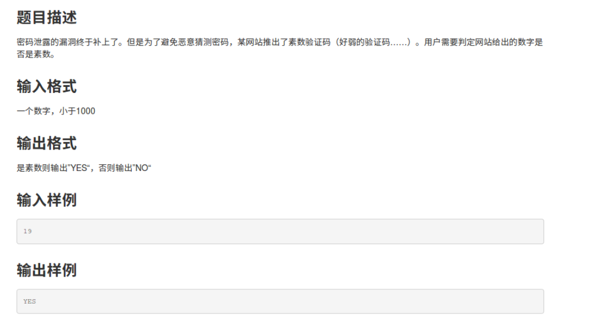
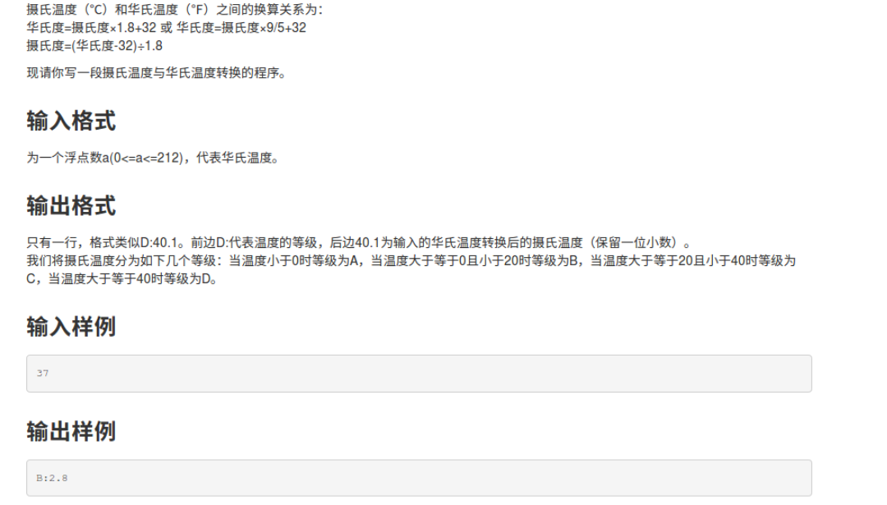
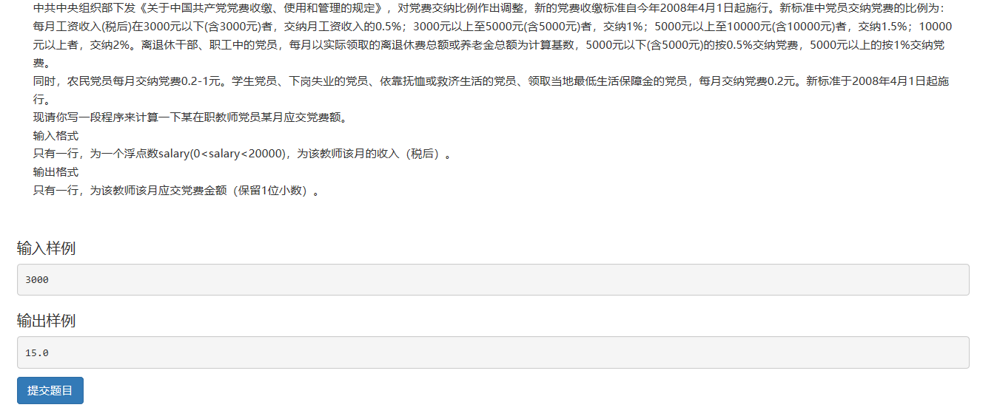
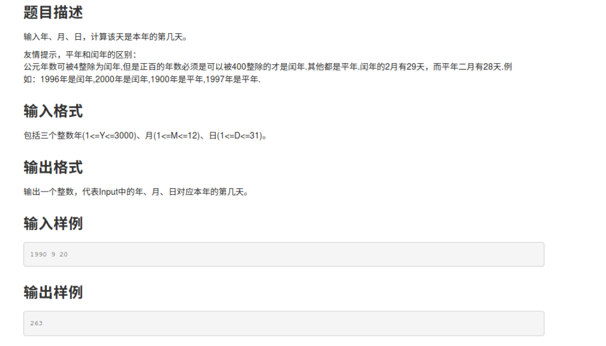
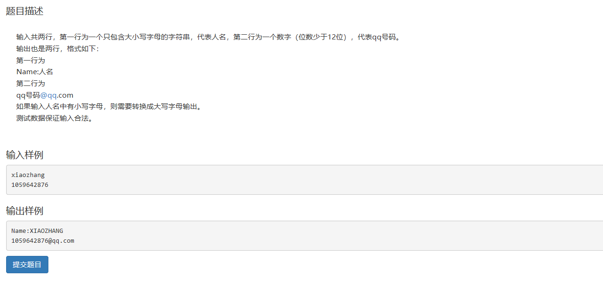
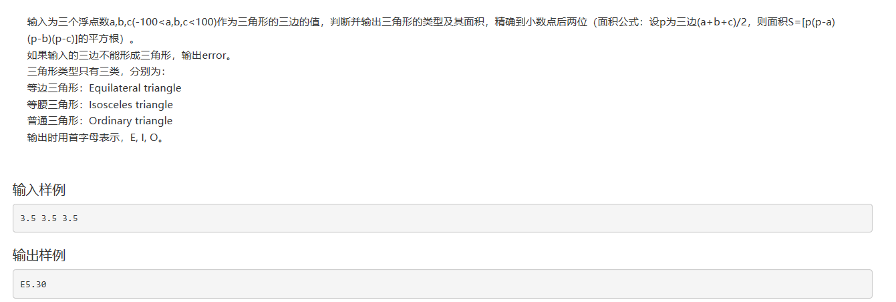

1.素数验证码
============

>   \#include\<stdio.h\>

>   \#include\<math.h\>

>   main()

>   { int a,i;

>   scanf("%d",\&a);

>   for(i=2;i\<=sqrt(a);i++)

>   {if(a%i==0) break;}

>   if(i\<=sqrt(a)) printf("NO");

>   else printf("YES");

>   }

2.摄氏度与华氏度
================

>   C:\\Users\\冯立\\Documents\\Tencent
>   Files\\2276542177\\FileRecv\\MobileFile\\Image\\WA7VP[MUNXOKBY6D1463]_M.png

>   \#include\<stdio.h\>

>   \#include\<math.h\>

>   main()

>   { float hua,she;

>   char c; //用c来表示等级

>   scanf("%f",\&hua);

>   she=(hua-32)/1.8;

>   if(she\<0) c='A';

>   else if(she\>=0&&she\<20) c='B';

>   else if(she\>=20&&she\<40) c='C';

>   else c='D';

>   printf("%c:%.1f",c,she);

>   }

3.党费
======

>   C:\\Users\\冯立\\Documents\\Tencent
>   Files\\2276542177\\FileRecv\\MobileFile\\Image\\9[%HFP{2T1[0DJ1IT2IYIBU.png

>   \#include\<stdio.h\>

>   \#include\<math.h\>

>   main()

>   { float a,c;

>   scanf("%f",\&a);

>   if(a\>0&&a\<=3000) c=0.005\*a;

>   else if(a\>3000&&a\<=5000) c=0.01\*a;

>   else if(a\>5000&&a\<=10000) c=0.015\*a;

>   else c=0.02\*a;

>   printf("%.1f",c);

>   system("pause");

>   }

4.今年的第几天
==============

>   C:\\Users\\冯立\\Documents\\Tencent
>   Files\\2276542177\\FileRecv\\MobileFile\\Image\\NPA\@I\`FDF\@W55[OUWZBCL2L.png

>   \#include\<stdio.h\>

>   main()

>   {

>   int mon[12]={31,28,31,30,31,30,31,31,30,31,30,31};

>   int year,day,month,i,sum=0;

>   scanf("%d %d %d",\&year,&month,&day);

>   if(year%4==0&&year%100!=0\|\|year%400==0)

>   mon[1]=29; //闰年的特殊处理

>   for(i=0;i\<month-1;i++)

>   {sum=sum+mon[i];}

>   sum=sum+day;

>   printf("%d",sum);

>   }

5.姓名与QQ号
============

>   C:\\Users\\冯立\\Documents\\Tencent
>   Files\\2276542177\\FileRecv\\MobileFile\\Image\\PL(V}H\$C2UU\~2%H5W]P5Z]G.png

>   \#include\<stdio.h\>

>   main()

>   {char name;

>   scanf("%c",\&name);

>   printf("Name:");

>   while(name!='\\n')

>   {if(name\<='z'&&name\>='a')

>   {name-=32;}

>   printf("%c",name);

>   scanf("%c",\&name); //一个字符一个字符的输入和输出

>   }

>   printf("\\n");

>   double q;

>   scanf("%lf",\&q);

>   printf("%.0lf\@qq.com",q);

>   system("pause");

>   }

6. 三角形面积
=============

>   \#include\<stdio.h\>

>   \#include\<math.h\>

>   main()

>   { float a,b,c,p,s;

>   char x;

>   scanf("%f%f%f",\&a,&b,&c);

>   if(a+b\>c&&a+c\>b&&b+c\>a) //判断是否可以构成三角形

>   { p=(a+b+c)/2;

>   s=sqrt(p\*(p-a)\*(p-b)\*(p-c));

>   if(a==b&&a==c&&b==c) //等边

>   x='E';

>   if((a==b&&a!=c)\|\|(a==c&&a!=b)\|\|(b=c&&b!=a)) //等腰

>   x='I';

>   if(a!=b&&a!=c&&b!=c) //普通

>   x='O';

>   printf("%c%.2f",x,s);

>   }

>   else printf("error");

>   }

7. 大小顺序输出
===============

[./media/image7.png](./media/image7.png)
========================================

~   C:\\Users\\冯立\\Documents\\Tencent
    Files\\2276542177\\FileRecv\\MobileFile\\Image\\B44%QLKO]A\~9BC[I{E)HA79.png

>   \#include\<stdio.h\>

>   int main()

>   {

>   int n,a,b,num=0;

>   scanf("%d",\&n);

>   while(n--) //一组一组的执行

>   {

>   num=1; //每一组的num记得要归一

>   scanf("%d",\&a);

>   do

>   {

>   scanf("%d",\&b);

>   if(b\>a)

>   num++; //输入一个判断一次

>   }

>   while(b!=-1);

>   printf("%d\\n",num);

>   }

>   }
