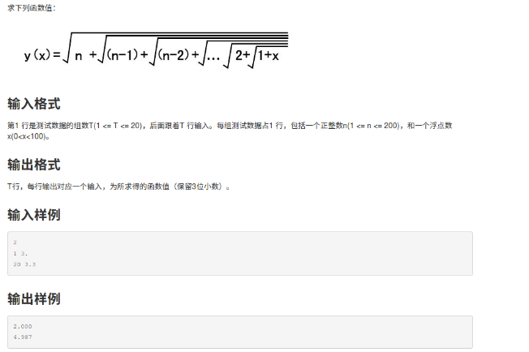
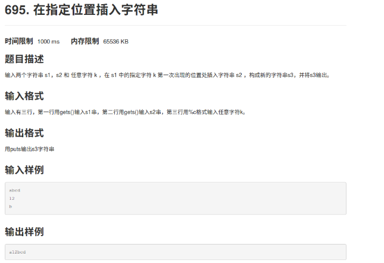
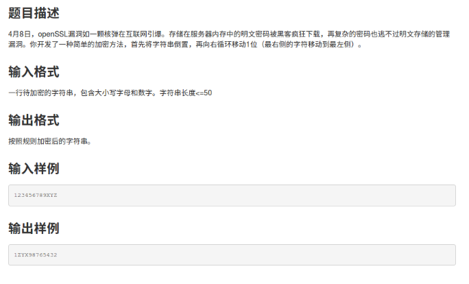

函数求值
========

\#include\<stdio.h\>

\#include\<math.h\>

main ()

{

int t,i,j,n[21];

float s,x[21],y[21];

scanf("%d",\&t);

for(i=0;i\<t;i++)

{ scanf("%d%f",\&n[i],&x[i]); }

for(i=0;i\<t;i++)

{ s=x[i];

for(j=1;j\<=n[i];j++)

{s=sqrt(j+s);} //递归求值

y[i]=s;

}

for(i=0;i\<t;i++)

printf("%.3f\\n",y[i]);

}

2.插入字符
==========

\#include\<stdio.h\>

\#include\<string.h\>

main ()

{

char s1[100],s2[100],s3[100],k;

int i,j,x,a,b;

gets(s1);

gets(s2);

scanf("%c",\&k);

a=strlen(s1);

b=strlen(s2);

for(i=0;s1[i]!=k\&&i\<a;i++)

{ } //求得k第一次出现的位置

for(j=0;j\<i;j++)

{s3[j]=s1[j];} //输出S1中K前面的元素

for(j=i,x=0;j\<i+b;j++,x++)

{s3[j]=s2[x];} //输出s2中的元素

for(j=i+b;j\<a+b;j++,i++)

{s3[j]=s1[i];} //输出S1中K后面的元素

puts(s3);

}

3.回文质数
==========

\#include\<stdio.h\>

\#include\<math.h\>

main ()

{

int hui(int i);

int zhi(int i);

int a,b,i;

scanf("%d%d",\&a,&b);

for(i=a;i\<=b;i++)

{

if(hui(i)&&zhi(i)) printf("%d\\n",i);

}

}

int hui(int i)

{

int h,n;

n=i;

h=0;

while(n)

{ h=h\*10+n%10;

n=n/10; }

return (h==i);

} //求其倒序数

int zhi(int i)

{ int j,k;

k=sqrt(i);

for(j=2;j\<=k;j++)

{if(i%j==0) return 0;} //若非质数，返回值为0

return 1; }

4.身份证最后一位
================

\#include\<stdio.h\>

\#include\<string.h\>

main ()

{ int t,i,sum[20],yu[20];

char s[100][20],m[100];

scanf("%d",\&t);

for(i=0;i\<t;i++)

scanf("%s",s[i]); //二维数组

for(i=0;i\<t;i++)

{
sum[i]=(s[i][0]-'0')\*7+(s[i][1]-'0')\*9+(s[i][2]-'0')\*10+(s[i][3]-'0')\*5+(s[i][4]-'0')\*8+(s[i][5]-'0')\*4+(s[i][6]-'0')\*2+(s[i][7]-'0')\*1+(s[i][8]-'0')\*6+(s[i][9]-'0')\*3+(s[i][10]-'0')\*7+(s[i][11]-'0')\*9+(s[i][12]-'0')\*10+(s[i][13]-'0')\*5+(s[i][14]-'0')\*8+(s[i][15]-'0')\*4+(s[i][16]-'0')\*2;

yu[i]=sum[i]%11; //求出之积之和求余数

switch(yu[i])

{

case 0:m[i]='1';break; //注意是字符

case 1:m[i]='0';break;

case 2:m[i]='X';break;

case 3:m[i]='9';break;

case 4:m[i]='8';break;

case 5:m[i]='7';break;

case 6:m[i]='6';break;

case 7:m[i]='5';break;

case 8:m[i]='4';break;

case 9:m[i]='3';break;

case 10:m[i]='2';break;

}

if(m[i]==s[i][17]) printf("right\\n");

else printf("wrong\\n"); }

}

5.羊皮卷轴
==========

\#include\<stdio.h\>

\#include\<string.h\>

main ()

{ int t,n,sum,i;

char s[1000001];

scanf("%d",\&t);

while(t--)

{ scanf("%s",s);

n=0;

for(i=0;s[i];i++)

{ n=n+s[i]-'0'; } //先求出第一次

while(n\>=10) //当各位数之和n大于10时都要执行

{ sum=0;

while(n!=0)

{ sum=sum+n%10;

n=n/10; } //求每次所得到数的各数位之和

n=sum;

}

printf("%d\\n",n);

}

}

6.倒序输出
==========

\#include\<stdio.h\>

\#include\<string.h\>

main ()

{ int i,n;

char s[51],t;

scanf("%s",s);

n=strlen(s);

for(i=1;i\<=n/2;i++)

{ t=s[i];

s[i]=s[n-i];

s[n-i]=t;

}

printf("%s",s);

}
