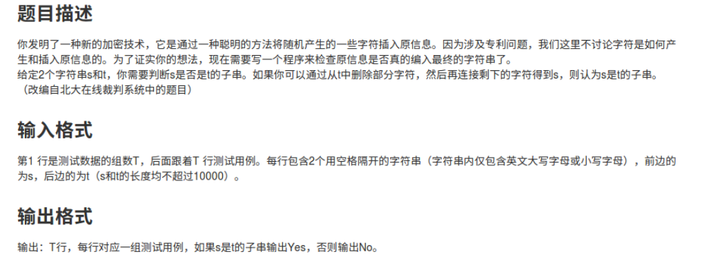
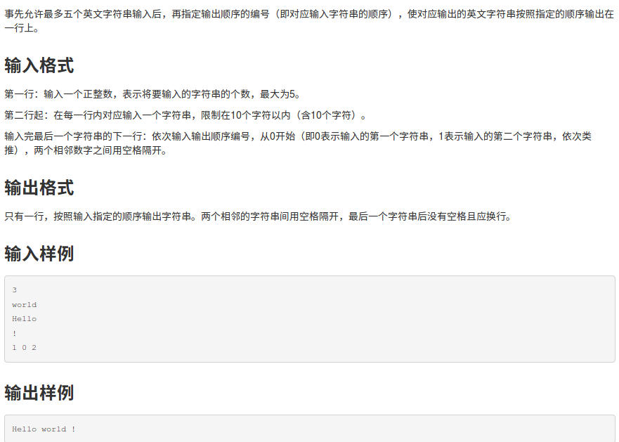
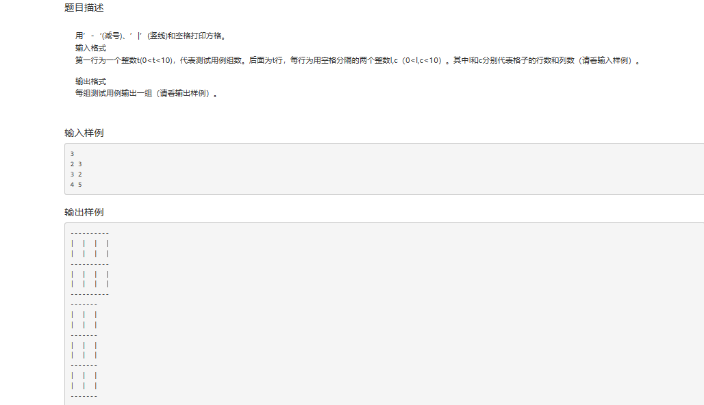
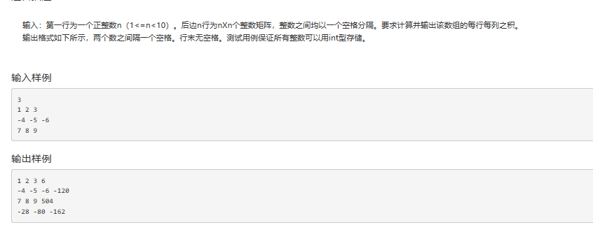
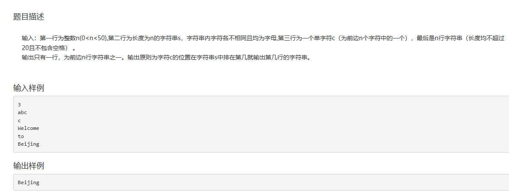
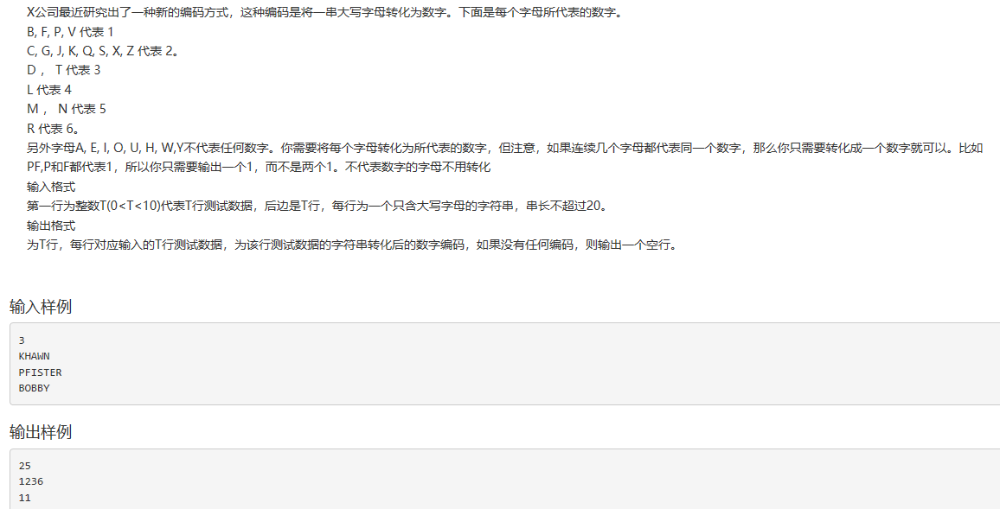

1. 新加密技术
=============

\#include\<stdio.h\>

\#include\<string.h\>

main()

{ char s[10000]={};

char t[10000]={};

int n,S,T,i,j;

scanf("%d",\&n); //输入测试组数

while(n--) //当n（组数）的逻辑值为真时，执行

{ i=0;

scanf("%s%s",s,t);

S=strlen(s);

T=strlen(t); //测两个字符的长度

for(j=0;j\<T;j++)

{ if(s[i]==t[j])

{i++;} } //比较两个字符的值是否相等 ，直到比较到不相等；
若一直相等，则比较到s[S]为‘\\0’与t[j]不相等.

if(i==S) printf("Yes\\n");

else printf("No\\n"); //判断是否为子串

}

}

2. 将字符串数组按指定顺序输出
=============================

\#include\<stdio.h\>

main()

{ int z,i,j;

char s[5][10]; //存放字符串二维数组

int p[5];

scanf("%d",\&z); //字符串个数

getchar();

for(i=0;i\<z;i++)

{gets(s[i]);} //输入z个字符串，并实现自动换行

for(i=0;i\<z;i++)

{scanf("%d",\&p[i]);} //输入输出的字符顺序

for(i=0;i\<z;i++)

{printf("%s ",s[p[i]]);} //输出新的字符串

printf("\\t\\n"); //最后一个字符串没有空格且应换行

}

**3.打印方格**
==============

\#include\<stdio.h\>

int main()

{ int a,b,c,i,j,k;

scanf("%d",\&a); //输入组数

for(k=0;k\<a;k++) //一组一组循环

{

scanf("%d %d",\&b,&c); //输入行数和列数

for(i=0;i\<b;i++)

{ for(j=0;j\<c;j++)

{printf("---");} printf("-\\n")； //注意将最后一列单独讨论，并且换行

for(j=0;j\<c;j++)

{printf("\| ");} printf("\|\\n");

for(j=0;j\<c;j++)

{printf("\| ");} printf("\|\\n");

}

for(j=0;j\<c;j++)

{printf("---");} printf("-\\n");} //注意将最后一行单独讨论

}

4. 求矩阵行列乘积
=================

\#include\<stdio.h\>

main()

{ int n,i,j,ji;

scanf("%d",\&n);

int a[n+1][n+1];

for(i=0;i\<n;i++)

{ for(j=0;j\<n;j++)

{ scanf("%d",\&a[i][j]);}

} //输入原始矩阵

for(i=0;i\<n;i++)

{ for(j=0,ji=1;j\<n;j++)

{ ji\*=a[i][j];}

a[i][n]=ji;} //给最后一个赋值，即行乘积

for(j=0;j\<n;j++)

{ for(i=0,ji=1;i\<n;i++)

{ ji\*=a[i][j];}

a[n][j]=ji;} //给最后一个赋值，即列乘积

for(i=0;i\<n;i++)

{ for(j=0;j\<n+1;j++)

{ printf("%d",a[i][j]);

j!=n?printf(" "): printf("\\n")；} } //输出原矩阵与行的乘积，注意控制空格与换行

for(j=0;j\<n;j++)

{ printf("%d",a[n][j]);

if(j\<n-1)

printf(" ");} //输出列的乘积

}

**5. 输出在同一位置的字符**

\#include\<stdio.h\>

main()

{

int n,i,a;

char c;

char s[50];

char str[50][50];

scanf("%d",\&n);

scanf("%s ",s); //输入字符一维数组

scanf("%c",\&c); //输入字符

for(i=0;i\<n;i++)

{scanf("%s",str[i]);} //输入字符串二维数组

for(i=0;i\<n;i++)

{ if(s[i]==c)

break;} //该字符在字符串里所在的位置，

>   就是要输出的字符串在字符串数组里所在的位置

printf("%s",str[i]); //用i来做标记

//system("pause");

}

**6. 车牌号正误判断**

![C:\\Users\\冯立\\Documents\\Tencent Files\\2276542177\\FileRecv\\MobileFile\\Image\\C]QXEPL_IP{3O_LEOWOXPQ0.png](media/e5b130b03616358dca1d4e8dfe772d2a.png)

\#include\<stdio.h\>

main()

{ char n[6];

int i,a=0,b=0,c=0;

scanf("%s",n);

for(i=0;i\<5;i++)

{ if(n[i]\>='a'&&n[i]\<='z')

n[i]=n[i]-32; } //先将小写转为大写

for(i=0;i\<4;i++)

{ if(n[i]=='I'\|\|n[i]=='O') break;

if(n[i]\>='A'&&n[i]\<='Z') a++;

if(n[i]\>='0'&&n[i]\<='9') b++; } //给前4个字符或数字计数

if(n[4]\>='0'&&n[4]\<='9') c++; //判断最后一个是不是数字（计数法）

if(a==2&&b==2&&c==1) printf("yes:%s",n);

else printf("no.");

}

**7. 字母转换为数字**

\#include\<stdio.h\>

main()

{ int T,i,k;

char str[10][21];

int a[21];

scanf("%d",\&T);

for(i=0;i\<T;i++)

scanf("%s",str[i]);

for(i=0;i\<T;i++)

{ for (k=0;str[i][k]!='\\0';k++) //用字符串结尾的空字符来控制循环结束

{switch(str[i][k])

{

case'B':

case'F':

case'P':

case'V':a[k]=1;break;

case'C':

case'G':

case'J':

case'K':

case'Q':

case'S':

case'X':

case'Z':a[k]=2;break;

case'D':

case'T':a[k]=3;break;

case'L':a[k]=4;break;

case'M':

case'N':a[k]=5;break;

case'R':a[k]=6;break;

default:a[k]=0;}

if(k==0\&&a[k]!=0)printf("%d",a[k]); //注意将k=0单独考虑（否则k-1=-1无意义）

else if(a[k]!=a[k-1]\&&a[k]!=0)printf("%d",a[k]);
//判断是否为上一个数的重复值是否//为错误值

}

printf("\\n"); //控制换行

}

}
